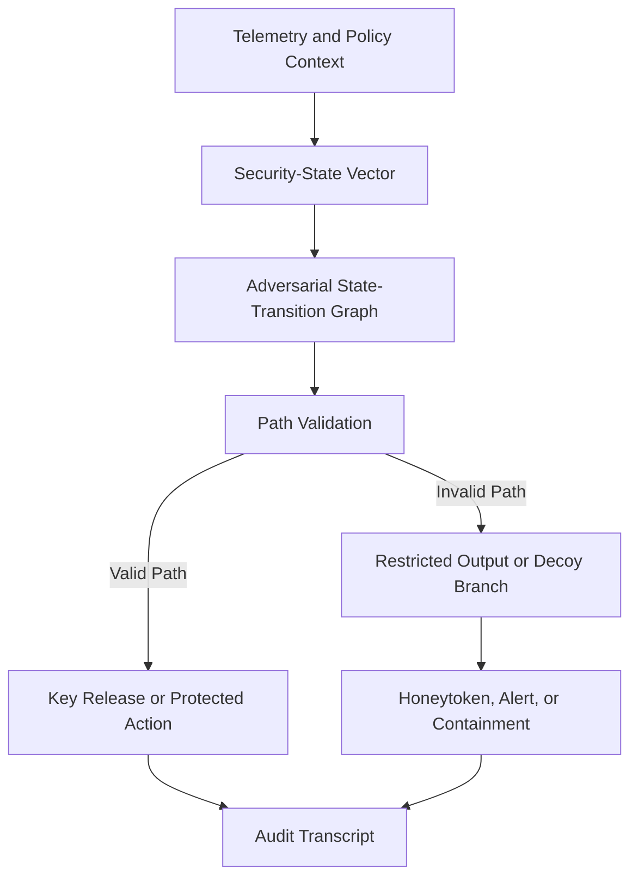

# Adversarial State-Tree Cryptographic Access Control

This repository presents an engineering proof of concept for telemetry-bound cryptographic access control and deception. The system models security context as a constrained state-transition graph. Protected data, key material, or sensitive security actions are released only after a valid transition path is verified. Invalid paths can trigger denial, restricted output, decoys, honeytokens, audit logging, or containment.

This repository is a public technical disclosure and engineering proof of concept authored by Isaac Kong Thor.

The material documents architecture, implementation concepts, validation behavior, limitations, and reproducible examples for adversarial state-tree cryptographic access control.

Nothing in this repository is legal advice. Patentability, ownership, filing strategy, and claim scope require review by qualified patent counsel.

**Maintained by:** Isaac Kong Thor (`codethor0`)

---

## Overview

Adversarial State-Tree Cryptographic Access Control binds protected data access and protected security actions to live telemetry, policy, and validated transition paths. Instead of relying on static credentials alone, the architecture evaluates whether endpoint, identity, process, alert, tenant, and risk context form a coherent and policy-permitted sequence before releasing cryptographic material or authorizing sensitive actions.

The chessboard traversal and S-box code in `src/` is an optional deterministic state-permutation embodiment. It demonstrates one way to generate bijective state permutations for research and validation. It is not the full scope of the architecture.

## System Flow



The diagram shows the public proof-of-concept flow. Telemetry and policy context are normalized into a security-state vector, validated against an adversarial state-transition graph, and used to decide whether to release protected material, authorize a protected action, restrict output, or route the request into a deception branch.

Additional diagrams are in [docs/mermaid_diagrams.md](docs/mermaid_diagrams.md).

---

## Problem

Security platforms often authorize access using static tokens, role checks, or isolated policy predicates. That model can be insufficient when:

- Endpoint, identity, process, tenant, and threat context changes during a session
- SOC automation or playbook engines can execute sensitive actions with high impact
- Stolen tokens may replay from unexpected hosts or contexts
- Agentic SOC workflows need stateful gating before executing privileged actions

There remains a need for access control that binds authorization to telemetry, policy, and path validation rather than to static credentials alone.

---

## Core Formula

The architecture uses a composite security score:

`S_sec(t) = T_ctx(t) × G_adv(t) × P_val(t) × K_bind(t) × D_resp(t)`

See [docs/formula.md](docs/formula.md) for definitions, examples, and fail-closed behavior.

---

## Architecture

Modules include telemetry intake, state normalization, policy compilation, state-tree generation, transition validation, cryptographic material management, protected action gating, deception branches, audit logging, and response orchestration.

See [docs/architecture.md](docs/architecture.md) and [docs/mermaid_diagrams.md](docs/mermaid_diagrams.md).

---

## How It Works

1. A request arrives for protected data or a protected security action.
2. Telemetry and policy context are collected and normalized.
3. A constrained state-transition graph is selected or generated.
4. The requested or observed transition path is validated.
5. On success, cryptographic rehydration or action authorization may proceed.
6. On failure, the system denies, restricts, deceives, logs, or contains according to policy.

Run the state-tree demo:

```bash
python scripts/state_tree_demo.py
```

---

## Proof of Concept

| Component | Location | Purpose |
|-----------|----------|---------|
| State-tree validation demo | `scripts/state_tree_demo.py` | ALLOW, DENY, DECOY, CONTAIN scenarios |
| Example JSON fixtures | `examples/` | Graph, policy, telemetry, path cases |
| Chessboard embodiment | `src/`, `run_full_proof.py` | Deterministic traversal and S-box validation |

See [docs/proof_of_concept.md](docs/proof_of_concept.md).

---

## Running Locally

```bash
git clone <repository-url>
cd ChessboardCrypto_PatentPrototype
python3 -m venv .venv
source .venv/bin/activate
pip install -r requirements.txt
make test
make proof
make demo
```

---

## Docker Lab

```bash
docker compose build
docker compose run --rm app make test
docker compose run --rm app make proof
docker compose run --rm app make demo
```

---

## Validation

```bash
python -m pytest -q
python run_full_proof.py
python scripts/state_tree_demo.py
```

See [docs/validation.md](docs/validation.md) for expected outputs, known warnings, and limitations.

---

## Mermaid Diagrams

The main system flow appears near the top of this README. The full diagram set is in [docs/mermaid_diagrams.md](docs/mermaid_diagrams.md).

---

## Security Model

Threat model and defensive controls are documented in [docs/threat_model.md](docs/threat_model.md).

Report security concerns using [SECURITY.md](SECURITY.md).

---

## Limitations

See [docs/limitations.md](docs/limitations.md).

---

## What This Project Is

- An engineering prototype and public technical disclosure
- A research proof of concept for telemetry-bound access control
- A patent drafting aid subject to formal legal review
- A reproducible demonstration of one deterministic state-permutation embodiment

---

## What This Project Is Not

This repository is an engineering prototype and public technical disclosure. It is not a production cryptographic library and must not be used to protect real data without independent cryptographic review.

Additional boundaries:

- Not formally validated or certified by any standards body
- Not a formal proof of cryptographic security
- Not integrated with any specific vendor security product
- Not legal advice or a filed patent application
- Not suitable for deployment into live security tooling without independent review

The statistical checks are engineering sanity checks inspired by NIST SP 800-22. They are not formal NIST validation, certification, or proof of cryptographic security.

The chessboard traversal/S-box implementation is an example deterministic state-permutation embodiment, not the full scope of the architecture.

---

## Patent Notice

See [docs/patent_notice.md](docs/patent_notice.md) and [NOTICE](NOTICE).

---

## Public Disclosure Notice

See [docs/public_disclosure.md](docs/public_disclosure.md) and [PUBLIC_DISCLOSURE.md](PUBLIC_DISCLOSURE.md).

---

## Contributing

See [docs/contributing.md](docs/contributing.md).

---

## Roadmap

See [docs/roadmap.md](docs/roadmap.md).

---

## License

Copyright (c) 2026 Isaac Kong Thor. All Rights Reserved. See [LICENSE](LICENSE).
