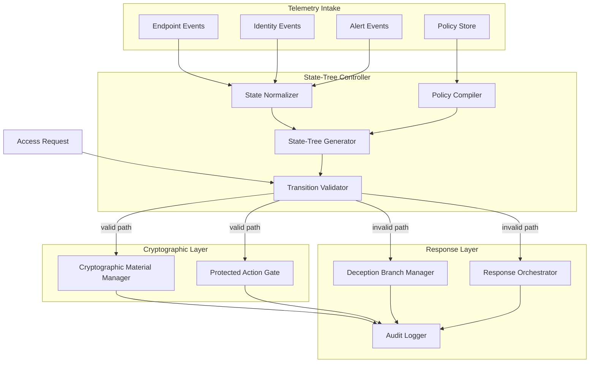

# Architecture

## System Overview

Adversarial State-Tree Cryptographic Access Control models security context as a constrained adversarial state-transition graph. Telemetry from endpoint agents, identity systems, case management systems, alert sources, and policy engines is normalized into state features. Transitions represent permitted moves. Cryptographic material and protected security actions are released only when a valid path is verified. Invalid paths trigger defensive responses.

The chessboard code in `src/` is an optional embodiment-specific state permutation generator. It is not required for the broader architecture.

## High-Level Diagram

## Module Reference

### Telemetry Intake Module

- **Input:** Raw events from endpoint agents, identity providers, SIEM alerts, case systems, cloud workload telemetry
- **Processing:** Parse, deduplicate, timestamp, attach tenant and source metadata
- **Output:** Normalized telemetry events
- **Failure behavior:** Reject or quarantine malformed events; fail closed on missing critical fields

### State Normalization Module

- **Input:** Normalized telemetry events
- **Processing:** Map events to endpoint, identity, process, network, workload, alert, case, tenant, and risk features
- **Output:** Security state vector
- **Failure behavior:** Mark incomplete vectors; reduce telemetry context score

### Policy Compiler

- **Input:** Tenant policy documents, action catalogs, risk rules, approval requirements
- **Processing:** Compile policy into graph constraints, transition rules, and release conditions
- **Output:** Policy version, transition rules, protected action definitions
- **Failure behavior:** Reject requests bound to unknown or expired policy versions

### State-Tree Generator

- **Input:** Security state vector, compiled policy, graph templates
- **Processing:** Select or generate constrained state-transition graph with nodes, edges, and mutation policy
- **Output:** State-transition graph
- **Failure behavior:** Deny requests when graph cannot be generated or has expired

### Transition Validator

- **Input:** Requested action, observed node sequence, graph, telemetry, policy
- **Processing:** Validate contiguous transitions, edge conditions, risk thresholds, and terminal action mapping
- **Output:** Path validation result, path transcript, composite score
- **Failure behavior:** Route to deception or denial branch

### Cryptographic Material Manager

- **Input:** Validated path transcript, key-share bindings, release conditions
- **Processing:** Retrieve or derive wrapped key shares bound to nodes or transitions
- **Output:** Rehydrated secret reference or denied release
- **Failure behavior:** Never release production secrets on invalid paths; optional decoy material only

### Protected Action Gate

- **Input:** Validated path transcript, requested security action, approval state
- **Processing:** Authorize endpoint isolation, script execution, file retrieval, artifact decryption, or administrative actions
- **Output:** Action authorization token or denial
- **Failure behavior:** Deny action and log evidence

### Deception Branch Manager

- **Input:** Invalid path transcript, deception policy
- **Processing:** Select decoy output, honeytoken, restricted response, or escalation
- **Output:** Deception event and response payload
- **Failure behavior:** Default to deny and log if deception policy unavailable

### Audit and Evidence Logger

- **Input:** Decision, path transcript, actor, endpoint, tenant, policy version
- **Processing:** Append evidence record with hash or signature reference
- **Output:** Audit record
- **Failure behavior:** Block protected release if audit write fails when policy requires fail-closed auditing

### Response Orchestration Module

- **Input:** Decision, action authorization, deception event
- **Processing:** Invoke playbook engine, endpoint agent commands, case updates, or containment workflows
- **Output:** Response action status
- **Failure behavior:** Roll back or escalate on partial failure according to policy

### Embodiment-Specific State Permutation Generator

- **Input:** Deterministic seed, grid parameters, traversal rules
- **Processing:** Generate bijective state permutation using chessboard traversal embodiment
- **Output:** Permutation table for optional cryptographic or indexing use
- **Failure behavior:** Reject invalid seeds or non-bijective output in validation pipeline

## Data Structures

### TelemetryEvent

| Field | Description |
|-------|-------------|
| event_id | Unique event identifier |
| timestamp | Event time |
| tenant_id | Tenant identifier |
| endpoint_id | Endpoint identifier |
| user_id | User or service identity |
| session_id | Session identifier |
| process_id | Process identifier |
| parent_process_id | Parent process identifier |
| workload_id | Workload or application identifier |
| source | Telemetry source name |
| event_type | Event category |
| verdict | Source verdict if present |
| confidence | Source confidence score |
| raw_attributes | Additional source-specific fields |

### SecurityStateVector

| Field | Description |
|-------|-------------|
| endpoint_state | Endpoint posture |
| identity_state | Identity assurance level |
| process_lineage_state | Process lineage assessment |
| network_state | Network context |
| workload_state | Workload classification |
| alert_state | Alert status |
| case_state | Case or ticket status |
| tenant_policy_state | Tenant policy posture |
| risk_state | Aggregated risk assessment |
| time_state | Temporal validity context |

### PathTranscript

| Field | Description |
|-------|-------------|
| request_id | Request identifier |
| starting_node | Graph entry node |
| requested_action | Protected action name |
| observed_transitions | Observed edge sequence |
| validated_transitions | Transitions that passed validation |
| invalid_transitions | Transitions that failed validation |
| risk_score | Risk score at decision time |
| policy_version | Active policy version |
| decision | ALLOW, DENY, DECOY, CONTAIN, or LOG |
| response_action | Executed or proposed response |
| audit_hash | Audit record reference |

### KeyShareBinding

| Field | Description |
|-------|-------------|
| binding_id | Binding identifier |
| node_id | Bound graph node |
| transition_id | Bound transition |
| policy_version | Policy version for binding |
| share_reference | Wrapped share reference |
| release_condition | Condition required for release |
| expiration | Binding expiration time |
| audit_reference | Related audit record |

## Related Documents

- [formula.md](formula.md)
- [mermaid_diagrams.md](mermaid_diagrams.md)
- [proof_of_concept.md](proof_of_concept.md)
- [threat_model.md](threat_model.md)

## Applicable Platform Categories

This architecture is described in vendor-neutral terms and may apply to:

- endpoint detection and response systems
- extended detection and response platforms
- SIEM and security analytics platforms
- SOAR and security automation platforms
- zero-trust access control systems
- identity-aware access control systems
- key management and secret release systems
- deception and honeytoken platforms
- agentic SOC workflow controllers

No specific vendor product is required for the architecture to function.
