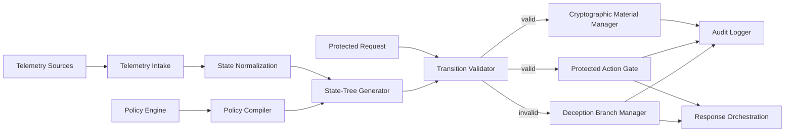
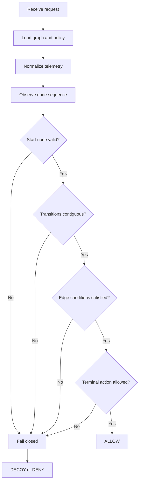
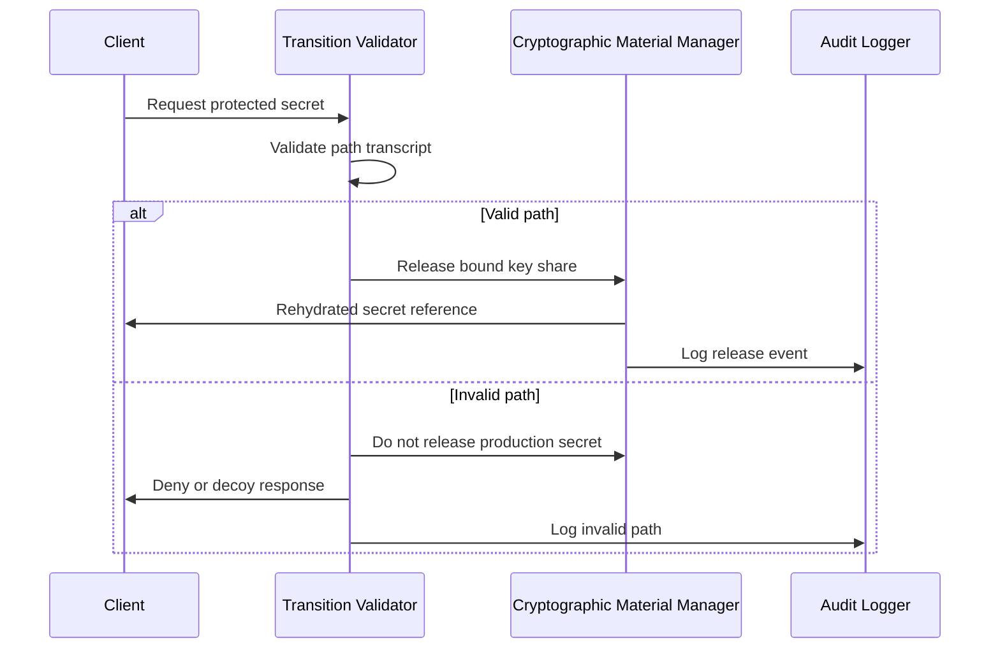
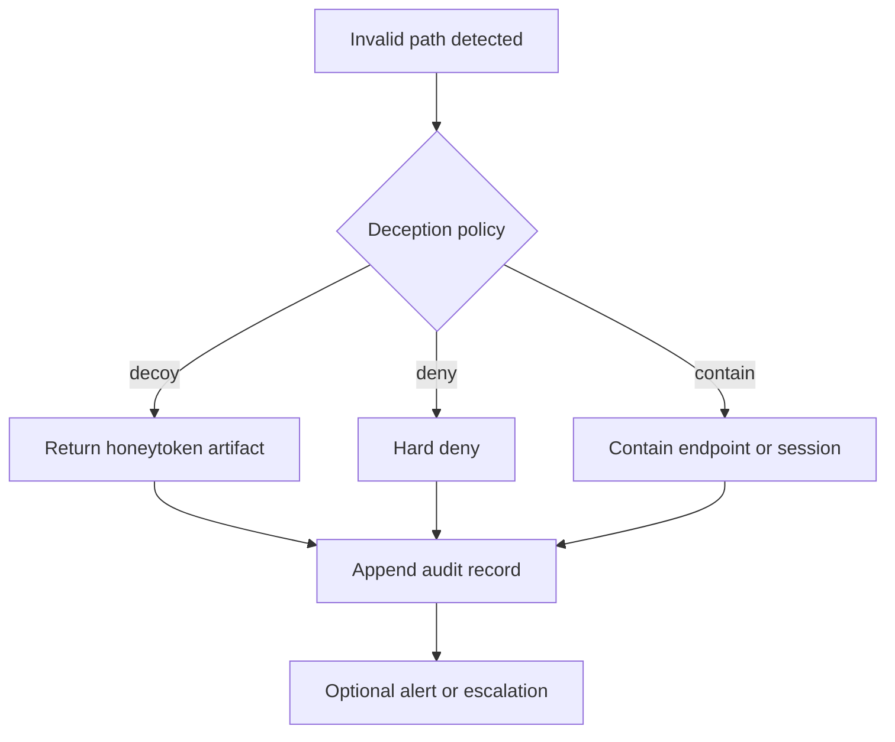
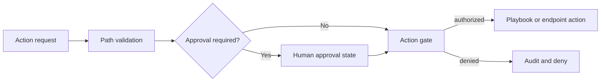
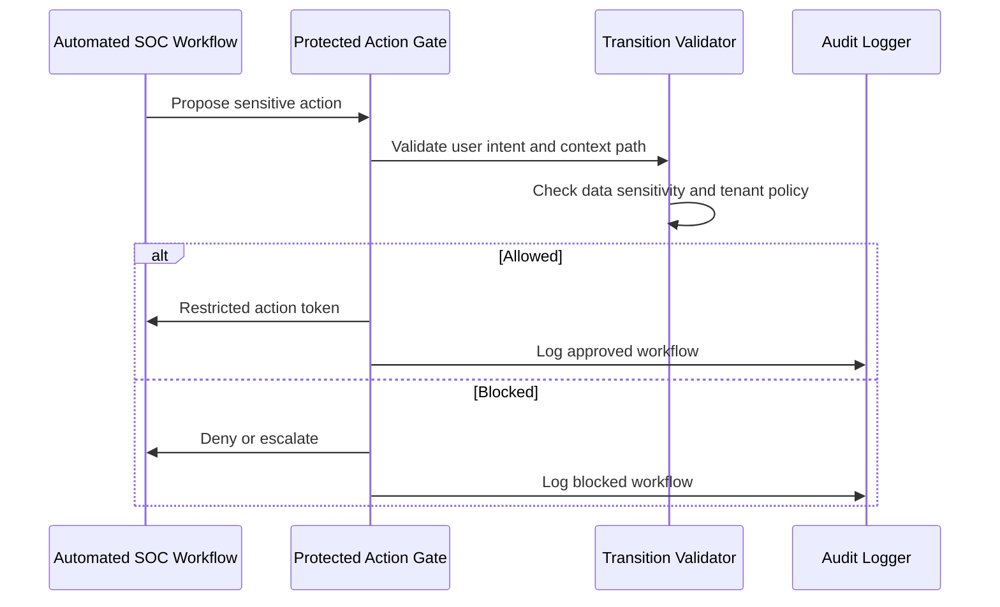
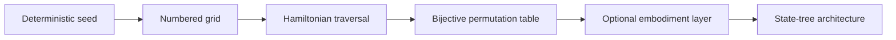
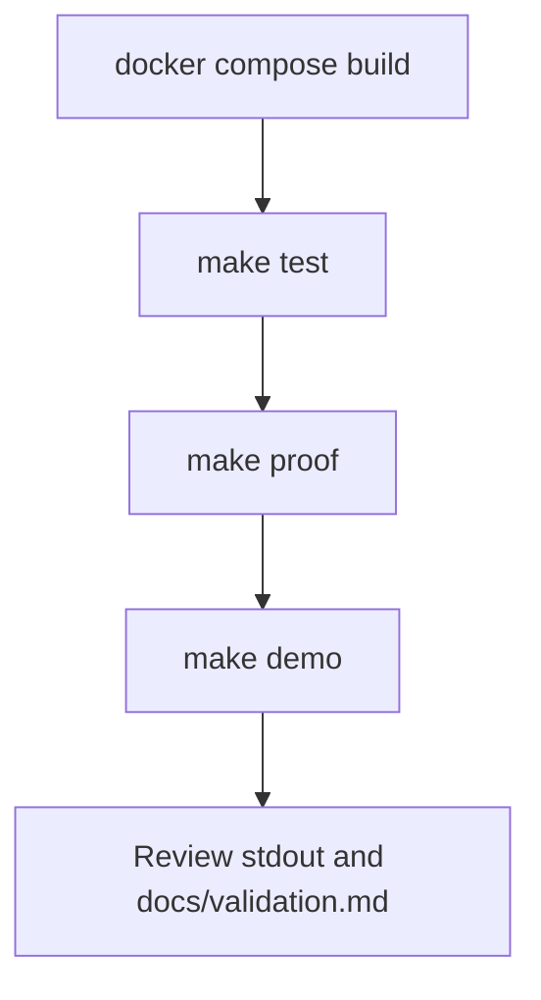

# Mermaid Diagrams

## 1. High-Level System



**Explanation:** Telemetry and policy feed graph generation. Requests are validated before release or action authorization. Invalid paths route to deception and audit.

**POC validation:** Run `python scripts/state_tree_demo.py` and confirm valid paths return `ALLOW` while skipped paths return `DECOY`.

---

## 2. State-Tree Path Validation



**Explanation:** Validation is sequential and fail-closed. Any failed check drives the composite score to zero.

**POC validation:** Inspect scenario output in `examples/path_validation_example.json`.

---

## 3. Cryptographic Rehydration Flow



**Explanation:** Production secrets are not released unless path constraints and key bindings match.

**POC validation:** The bundled `missing_key_binding` scenario forces `K_bind = 0` and a non-allow decision.

---

## 4. Invalid Path Deception Branch



**Explanation:** Invalid paths should produce evidence, not silent success.

**POC validation:** Policy `invalid_path_response: DECOY` in `examples/policy_example.json`.

---

## 5. Protected Action Gating



**Explanation:** Sensitive actions such as isolation, script execution, or artifact retrieval require validated path and optional approval.

**POC validation:** Compare `decrypt_artifact` and `isolate_endpoint` scenarios in the demo output.

---

## 6. Agentic SOC Workflow Gating



**Explanation:** Automated SOC workflows receive the same path and policy gating as human operators.

**POC validation:** Architecture-level only in this repository. Extend examples with workflow state in future releases.

---

## 7. Chessboard Embodiment Mapping



**Explanation:** Chessboard traversal generates deterministic state permutations. The broader architecture does not depend on chess rules.

**POC validation:** Run `python run_full_proof.py` and confirm 2D and 3D bijective checks pass.

---

## 8. Docker Lab Flow



**Explanation:** Containerized validation reproduces local engineering checks without host-specific paths.

**POC validation:**

```bash
docker compose build
docker compose run --rm app make test
docker compose run --rm app make proof
docker compose run --rm app make demo
```
